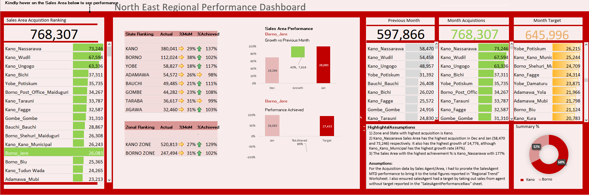

# Salesperson-Dashboard-using-Excel

## Introduction

An Excel file showing dashboard of a telecommunications company. The Dashboard shows Sales Area Performance, indicating
growth against previous month, performance achieved and Regional Ranking by Sales Areas, State and Zones

## Skills/Concepts demonstrated

- Absolute Reference
- Converting Dataset to Table
- VlookUP, IFERROR
- Calculating Growth Rate
- Offset function
- Dashboard design (Pie chart, Bar chart, Conditional formatting)
